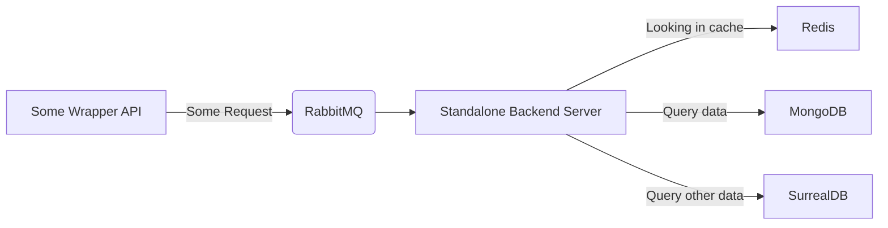

# The Backend 

[![Website](https://img.shields.io/badge/website-%23.svg?style=for-the-badge&color=%232D2D2D&logo=data:image/svg%2bxml;base64,PHN2ZyB4bWxucz0iaHR0cDovL3d3dy53My5vcmcvMjAwMC9zdmciIGhlaWdodD0iMWVtIiB2aWV3Qm94PSIwIDAgNjQwIDUxMiI+PCEtLSEgRm9udCBBd2Vzb21lIFBybyA2LjQuMiBieSBAZm9udGF3ZXNvbWUgLSBodHRwczovL2ZvbnRhd2Vzb21lLmNvbSBMaWNlbnNlIC0gaHR0cHM6Ly9mb250YXdlc29tZS5jb20vbGljZW5zZSAoQ29tbWVyY2lhbCBMaWNlbnNlKSBDb3B5cmlnaHQgMjAyMyBGb250aWNvbnMsIEluYy4gLS0+PGRlZnM+PHN0eWxlPi5mYS1zZWNvbmRhcnl7b3BhY2l0eTowLjQ7ZmlsbDojNmNlZmYwO30uZmEtcHJpbWFyeXtmaWxsOiM2Y2VmZjA7fTwvc3R5bGU+PC9kZWZzPjxwYXRoIGNsYXNzPSJmYS1wcmltYXJ5IiBkPSJNMzA0IDY0YTE0NCAxNDQgMCAxIDAgMCAyODggMTQ0IDE0NCAwIDEgMCAwLTI4OHpNMTExIDM2N2MtOS40IDkuNC05LjQgMjQuNiAwIDMzLjlzMjQuNiA5LjQgMzMuOSAwbDE4LjUtMTguNWMzNC4zIDI3LjcgNzQuOSA0My44IDExNi41IDQ4LjNWNDY0SDE4NGMtMTMuMyAwLTI0IDEwLjctMjQgMjRzMTAuNyAyNCAyNCAyNEg0MjRjMTMuMyAwIDI0LTEwLjcgMjQtMjRzLTEwLjctMjQtMjQtMjRIMzI4VjQzMC43YzQ5LjEtNS4zIDk2LjgtMjYuNyAxMzQuNC02NC4zYzgxLjctODEuNyA4Ny4xLTIxMSAxNi4xLTI5OC45TDQ5NyA0OWM5LjQtOS40IDkuNC0yNC42IDAtMzMuOXMtMjQuNi05LjQtMzMuOSAwTDQyOC41IDQ5LjZjLTkuNCA5LjQtOS40IDI0LjYgMCAzMy45YzY4LjcgNjguNyA2OC43IDE4MC4yIDAgMjQ4LjlzLTE4MC4yIDY4LjctMjQ4LjkgMGMtOS40LTkuNC0yNC42LTkuNC0zMy45IDBMMTExIDM2N3oiLz48cGF0aCBjbGFzcz0iZmEtc2Vjb25kYXJ5IiBkPSIiLz48L3N2Zz4=)](https://uroria.com)

The **Uroria Backend** serves as a non-scalable, dedicated component with a single mission: 
to ensure the availability of data across all locations. 
Written in Java, it functions as a data synchronization and distribution system. 
This backend leverages **RabbitMQ** for communication, ensuring data consistency and reliability, 
and it employs **Redis** for caching to optimize data access. Additionally, it interfaces with various databases, 
including **MongoDB**, to store and manage the distributed data. 
Its sole purpose is to make data universally accessible, 
guaranteeing data ubiquity while remaining non-scalable for this particular function.

### An Uroria Project
**This is an official Uroria project**, *exclusively intended* for Uroria, and therefore,
support for other use cases is not provided.
However, we welcome _pull requests_, and _contributing_ in this manner can lead to earning certain **in-game rewards**.
This feature will come soon, so stay tuned and **join [our Discord](https://dc.uroria.com)** to **not miss any news**.

## How it works

The Backend has the capability to **respond to data requests** on demand, 
**update data everywhere**, and **cache data everywhere** for **maximum performance**.
Requests, updates, and other interactions are transmitted via RabbitMQ.
Data is transmitted in JSON objects, as they work seamlessly both within and outside the Java environment.
In addition, a cache is integrated into each client, facilitating faster request processing.
Furthermore, the standalone backend server utilizes Redis to temporarily store data, enhancing data retrieval performance.
In the event that a cache does not contain certain data, 
the backend server will query a theoretically arbitrary NoSQL database to retrieve the data.

# Off-topic

#### Language-keys
| Key                      | Description                                                       |
|--------------------------|-------------------------------------------------------------------|
| kick.format              | The kick screen format                                            |
| backend.perm.applyError  | In case of an exception while trying to apply permission-provider |
| backend.user.unfetchable | When the user is not fetch able via Backend                       |
| backend.user.joinError   | When the user is unable to join                                   |
